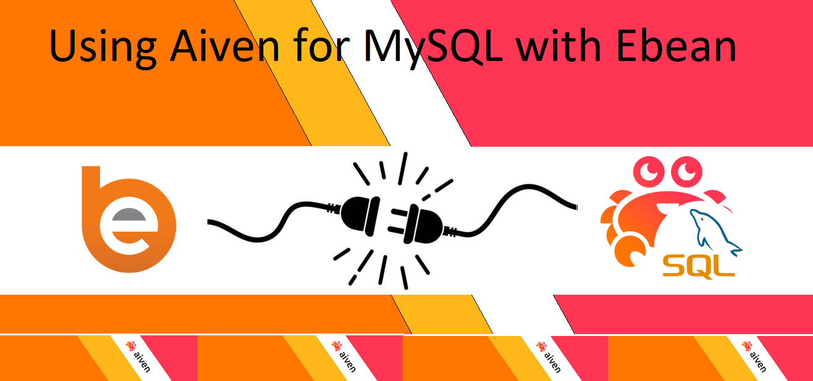
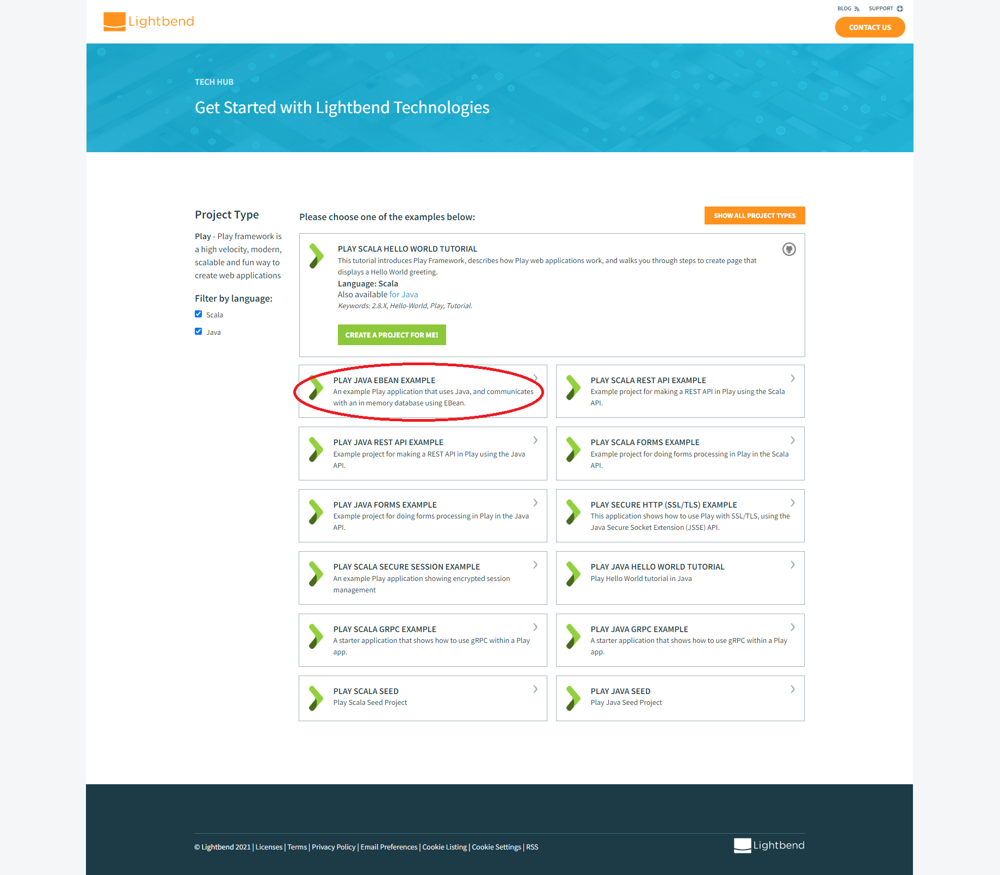
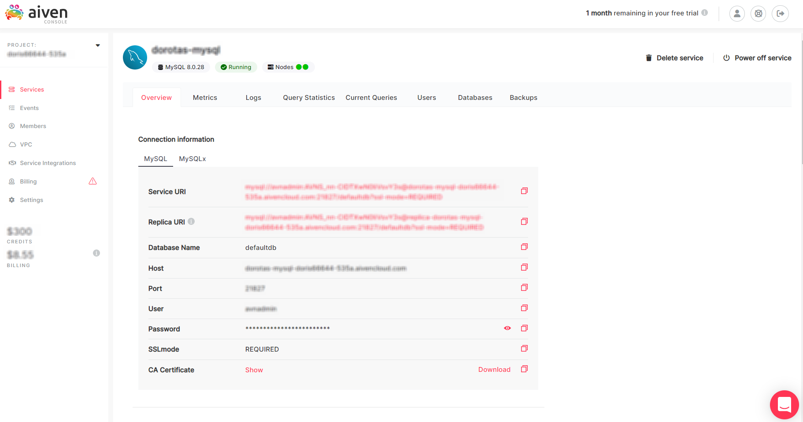
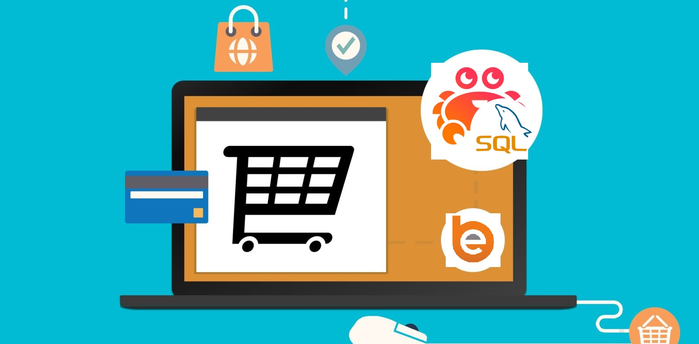

# Using Ebean ORM with Aiven for MySQL



## Which ORM tool to choose and why Ebean

There are tons of object-relational mapping (ORM) tools around these days. Why Ebean? The simpler means the better for me. That's why Ebean grew into my favorite ORM tool, which is not only user-friendly but also easy to learn and use. Ebean ORM is much simpler to understand than JDO (Java Data Objects), Hibernate, or JPA (Java Persistence API). What makes it even cooler is that it's free open-source software, which not only offers full ORM features (just like JPA) but also has SQL-relational features.

## In this post

I'll show you how to use eBean ORM with MySQL®, one of the most widely-used and multi-purpose databases. For demo purposes, I'll use a mock Play Java application with eBean pre-integrated. Since the Play app doesn't use MySQL as its default datastore, I'll demonstrate how to connect the app to MySQL using Aiven for MySQL.

## Set up an application

First, you need an application (for example, in Java) that could communicate with a database using eBean. For purposes of this post, I'll [use a Play Java application](#reuse-a-play-java-app) but you can [create your own app](#app-from-scratch) all the same.

### Reuse a Play Java app

You can use [Play Framework](https://www.playframework.com/), which offers a mock app that comes with Ebean ORM. You only need to enable it, which is nicely detailed in [Using eBean OMR](https://www.playframework.com/documentation/2.6.x/JavaEbean).

When you have Play properly integrated with eBean, you can go straight to the [Play Java eBean example project](https://developer.lightbend.com/start/?group=play&project=play-samples-play-java-ebean-example) offered by [Lightbend](https://www.lightbend.com/) and download it to create your local copy.



### App from scratch

If you prefer to create your own Java application and integrate it with eBean yourself, eBean provides pretty extensive [documentation](https://ebean.io/docs/) on how to use it with your app. You can find loads of eBean ORM project examples at [ebean-orm-examples](https://github.com/ebean-orm-examples) or [ebean-orm/examples](https://github.com/ebean-orm/examples). In any case, starting from [Getting started](https://ebean.io/docs/getting-started/) sounds like a plan, doesn't it ;-)

## Create MySQL with Aiven

Now, let's move on to setting up the database. Aiven for MySQL is the best choice is if you need something that scales nicely and is easy and quick to set up. You can spin up an Aiven for MySQL cluster either via Aiven CLI or in [Aiven Console](https://console.aiven.io/).

To do that, first [sign up for a 30-day Aiven trial](https://console.aiven.io/signup) if you haven't done so by now. Otherwise, you can proceed straight to building your database.

### Aiven Console

1. Log in to [Aiven Console](https://console.aiven.io/) and [Create a new Aiven service](https://developer.aiven.io/docs/products/mysql/get-started.html).
2. Select the service name in the list to access **Overview** and configure your service setting up [available parameters](https://developer.aiven.io/docs/products/mysql/reference/advanced-params).

When the light turns green and the indicator changes from **Rebuilding** to **Running**, it means you're all set! Your service is up and running.



### Aiven CLI

If this is your first time with Aiven CLI, check out our [Getting started](https://developer.aiven.io/docs/tools/cli.html) guide.

To create your service, use the `avn service create` command and set up [available parameters](https://developer.aiven.io/docs/tools/cli/service#avn-service-create) as needed. For more advanced configuration, you may want to see the list of the [advanced customization parameters](https://developer.aiven.io/docs/products/mysql/reference/advanced-params.html).

Let's ahve a look at an example:

```shell
avn service create mysql-default            \
    --service-type mysql                    \
    --cloud google-europe-central2          \
    --plan business-4                       \
    -c mysql=true
```

What we're getting here is a new Aiven for MySQL service named `mysql-default` in region `google-europe-central2` with the `business-4` plan and the connection to `mysql` enabled.

## Connect the app to Aiven for MySQL

When both the app and the database are there, it's time to make them work together. Regardless of whether you choose to use the Play app or build your own, there are a few properties that you would need to configure to make it happen:

* [Configure the Play app database](#configure-the-play-app-database) or
* [Configure your own app database](#configure-your-app-database)

### Configure the Play app database

The database for your Play Java app can be configured in the `application.conf` file (available at `\play-samples-play-java-ebean-example\conf` in the downloaded example project when unzipped). The value of `db.default.url` defines the app database connection, which is `jdbc:h2:mem:play` by default.

```shell
# Configuration

# Database configuration

db.default.driver=org.h2.Driver
db.default.url="jdbc:h2:mem:play"

# Ebean configuration

ebean.default="models.*"

# Assets configuration

"assets.cache./public/stylesheets/bootstrap.min.css"="max-age=3600"

# Number of database connections
# See https://github.com/brettwooldridge/HikariCP/wiki/About-Pool-Sizing
fixedConnectionPool = 9

# Set Hikari to fixed size
play.db {
  prototype {
    hikaricp.minimumIdle = ${fixedConnectionPool}
    hikaricp.maximumPoolSize = ${fixedConnectionPool}
  }
}

# Job queue sized to HikariCP connection pool
database.dispatcher {
  executor = "thread-pool-executor"
  throughput = 1
  thread-pool-executor {
    fixed-pool-size = ${fixedConnectionPool}
  }
}
```

To connect the Play app to Aiven for MySQL, replace the default value of `db.default.url` with the value of `Service URI` available in [Aiven Console](https://console.aiven.io/) for your Aiven for MySQL service (**[Aiven Console](https://console.aiven.io/)** > **Services** > **Aiven for MySQL** > **Overview** > **Service URI**).

```shell
db.default.url="{your-service-uri-from-aiven-console}"
```

### Configure your app database

Similarly, if you decide to build your app or use examples from eBean ORM GitHub repo, you still need to define database properties in the relevant application file, for example `application.yaml` or `application.properties`.

```yaml
## load external properties
#load:
#  properties: ${user.home}/config/my-application.properties
ebean:
  dbSchema: ${db.username:my_app9}
  migration.run: true

datasource:
  db:
    username: ${db.username:my_app9}
    password: ${db.password:test}
    url: ${db.url:jdbc:postgresql://localhost:6432/my_app9}


#ebean:
#  docstore:
#    url: http://127.0.0.1:9200
#    active: true
#  migration:
#   run: true
```

To integrate your app to Aiven for MySQL, replace the default values of `username`, `password`, and `url` with the corresponding values for your Aiven service available in [Aiven Console](https://console.aiven.io/) for your Aiven for MySQL service (**[Aiven Console](https://console.aiven.io/)** > **Services** > **Aiven for MySQL** > **Overview**).

```yaml
datasource:
  db:
    username: ${your-service-user-from-aiven-console}
    password: ${your-service-password-from-aiven-console}
    url: ${your-service-uri-from-aiven-console}
```

Voila! Now your application is connected to Aiven for MySQL and you can run your app to test the connection.

## Check if it works

For testing your new setup, you need to create an `EbeanServer` instance (to save entities or run queries on the database) and two entities (for example, `Address` and `Client` as in the example that follows) to execute some basic operations on them.

To persist and access some data, start with creating a `Client` object and save it with `save()`. Then, update the client details and save it with `save()` again. At last, fetch and, next, delete the client using methods `find()` and `delete()`, respectively.

```java
Address a1 = new Address("88, Sunny Street", null, "London");
Client c1 = new Client("Tom Smith", a1);
EbeanServer server = Ebean.getDefaultServer();
server.save(c1);
c1.setName("Kim Jordan");
c1.setAddress(null);
server.save(c1);
Client foundC1 = Ebean.find(Client.class, c1.getId());
Ebean.delete(foundC1);
```

## What is it good for?

Your application integrated with Ebean and Aiven for MySQL is a powerful but simple tool that you can use to persist and query entities.

Good examples that show the potential of this setup are fintech applications, which have been growing in popularity for a while now. Software for Online Transaction Processing (OLTP), eCommerce, or fraud detection can be built using Eean and Aiven for MySQL.



## To conclude

Hopefully, I was able to prove my point that eBean and Aiven for MySQL work together like a Swiss army knife. No doubt that each dev equipped with such a weapon is able to face development challenges. And there is a legion of those who have already tried. Check out the [Ebean Google group](https://groups.google.com/g/ebean) and the [Aiven community](https://developer.aiven.io/docs/community.html), where you can post questions and seek answers.
